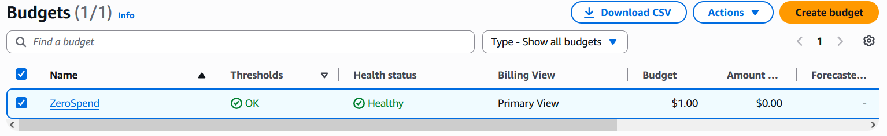
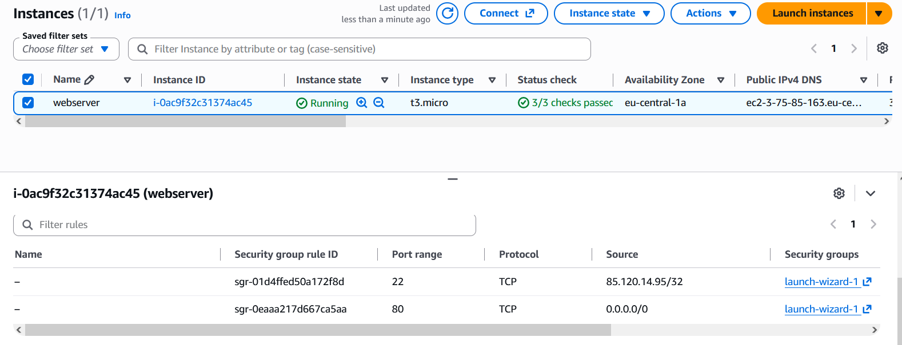
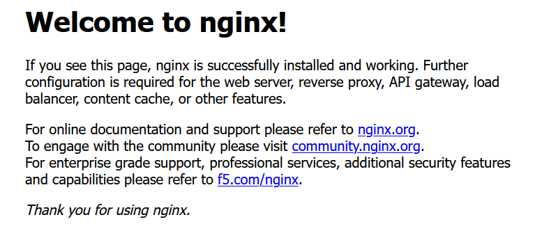
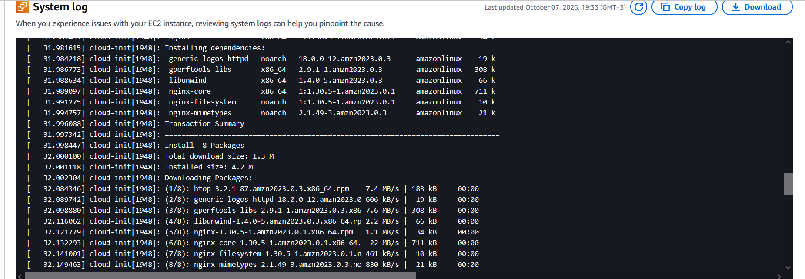
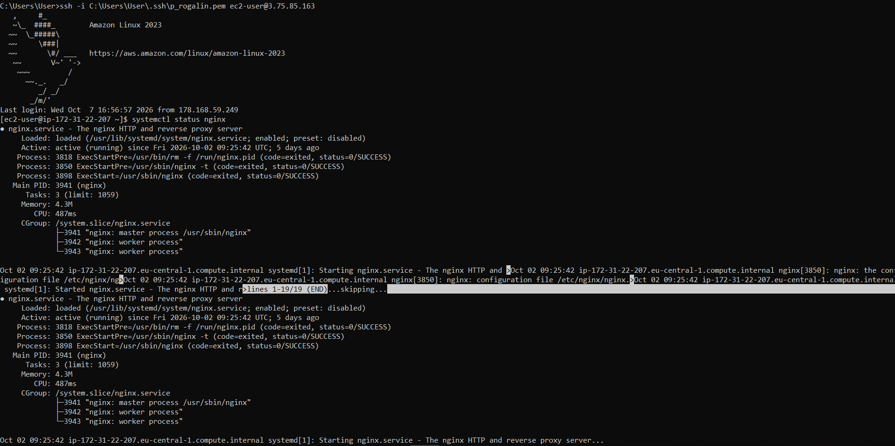
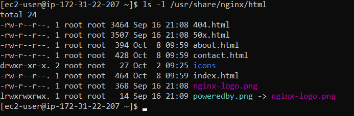
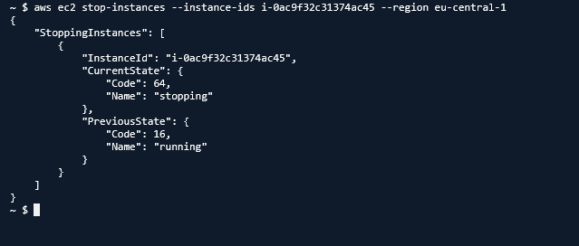

Отчёт по лабораторной работе: Основы AWS и EC2

ФИО: Рогалин Павел

Группа: IA2404

Выбранный уровень: Базовый
1. Скриншоты выполнения заданий
Задание 1: Настройка бюджета

На скриншоте виден созданный бюджет ZeroSpend с нулевым порогом в списке Budgets.
Задание 2: Запуск экземпляра EC2 и страница Nginx

На скриншоте виден экземпляр webserver в состоянии Running с пройденными проверками Status check (2/2).

На скриншоте представлена приветственная страница Nginx, открытая в браузере по публичному IP-адресу экземпляра.
Задание 3: Мониторинг и системный лог

На скриншоте показана вкладка Monitoring и фрагмент вывода System log с процессом установки пакета nginx.
Задание 4: Подключение по SSH

На скриншоте показано успешное подключение к экземпляру по SSH и вывод команды systemctl status nginx.
Задание 5: Развёртывание статического сайта

На скриншоте виден развёрнутый статический сайт, открытый в браузере по публичному IP-адресу.

На скриншоте показан вывод команды ls -l /usr/share/nginx/html с загруженными HTML-файлами.
Задание 6: Остановка экземпляра через AWS CLI

На скриншоте представлена команда aws ec2 stop-instances и полученный от неё JSON-вывод со статусом stopping.
2. Ответы на контрольные вопросы
Вопрос из Задания 1

Что разрешает политика AdministratorAccess? Почему для повседневной работы нельзя использовать root?

Политика AdministratorAccess предоставляет полные права на создание, изменение, просмотр и удаление любых ресурсов внутри всех сервисов AWS. Использовать root-аккаунт для повседневной работы крайне опасно, так как он обладает абсолютным неограниченным доступом (включая закрытие аккаунта и финансовые операции) и не поддаётся сужению прав. В случае компрометации root-учётной записи или случайной ошибки администратора последствия будут критическими, поэтому повседневную работу необходимо вести под ограниченным IAM-пользователем.
Вопрос из Задания 2

Что такое User data и когда выполняется этот скрипт? Выполнится ли он повторно после перезагрузки экземпляра?

User data — это набор команд или скрипт инициализации, который передаётся экземпляру EC2 при его создании для автоматической первоначальной настройки системы (установки ПО, конфигурации, запуска служб). Этот скрипт автоматически выполняется от имени пользователя root один раз при самом первом запуске (бутстрапе) виртуальной машины. При последующих штатных перезагрузках (Reboot) или циклах остановки и запуска (Stop/Start) скрипт повторно не выполняется.
Вопрос из Задания 3 (Часть 1)

Какая из проверок укажет на проблему, которую можете исправить вы, а какая на проблему на стороне AWS?

Instance status check указывает на проблему, которую должен исправлять пользователь, так как она отслеживает программные сбои внутри самой виртуальной машины (паника ядра, ошибки конфигурации сети или ОС, зависание файловой системы). System status check указывает на сбои на стороне AWS (неисправность физического сервера, стойки, сетевого оборудования или гипервизора); для её решения AWS обычно автоматически мигрирует экземпляр на исправное оборудование при перезапуске.
Вопрос из Задания 3 (Часть 2)

В каких случаях стоит включать детальный мониторинг (Detailed monitoring)?

Детальный мониторинг стоит включать для высоконагруженных и критически важных (production) систем, где 5-минутная задержка базовых метрик CloudWatch не позволяет быстро среагировать на аварии. Он необходим при настройке чувствительных правил автомасштабирования (Auto Scaling), чтобы оперативно регистрировать всплески нагрузки (каждую 1 минуту), а также при отладке узких мест производительности в реальном времени.
Вопрос из Задания 4

Почему для входа на экземпляр EC2 используется ключ, а не пароль?

Асимметричные SSH-ключи обеспечивают кардинально более высокий уровень безопасности по сравнению с паролями, так как они устойчивы к атакам методом перебора (brute-force) и перехвату трафика. Кроме того, использование ключей позволяет исключить человеческий фактор (слабые пароли) и упрощает автоматизацию подключений и скриптов управления без необходимости безопасного хранения паролей.
Вопрос из Задания 5

Что делает команда scp и чем она похожа на ssh?

Команда scp (Secure Copy Protocol) предназначена для безопасной передачи файлов между локальным компьютером и удалённым сервером (или между двумя серверами). Она похожа на ssh тем, что использует тот же самый протокол и порт SSH (порт 22), так же применяет асимметричные SSH-ключи для аутентификации и полностью шифрует передаваемый трафик.
Вопрос из Задания 6

Чем Stop отличается от Terminate? За что вы продолжаете платить, пока экземпляр остановлен?

При Stop виртуальная машина выключается (как обычный ПК), но её конфигурация и подключенные тома EBS сохраняются, что позволяет запустить её снова в любой момент. При Terminate экземпляр полностью и безвозвратно удаляется из инфраструктуры AWS вместе с локальными томами. Пока экземпляр остановлен (Stop), вы прекращаете платить за вычислительные мощности (CPU/RAM EC2), но продолжаете платить за выделенный диск (EBS-том), зарезервированные статические IP-адреса (Elastic IP) и сохранённые снапшоты.